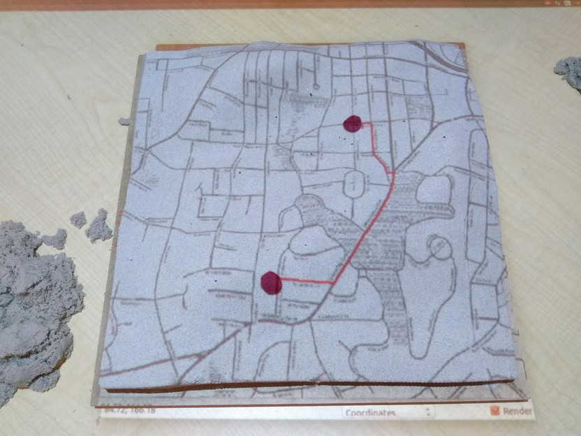
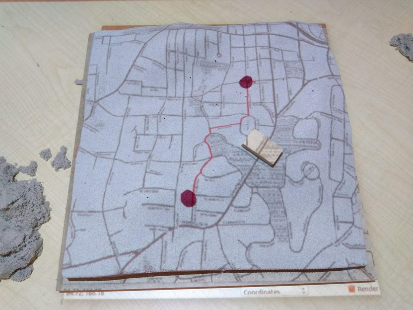

# Simple OSM routing application
Import `OSM_map.tif` and `OSM_speed.tif` into NC_spm location.
This application doesn't require any specific model, as long as the aspect ratio of the model
matches the data. Before running the application, the surface needs to be calibrated. To detect
the felt markers, the color value needs to be adjusted in `OSM.py`.
By placing any obstacle (wooden block, sand), it will detect the obstacle and reroute to avoid it.
Uses Least Cost Path algorithm for routing.

