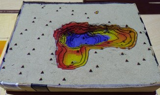

# Tangible subsurface visualization

In this application we explore 3D raster of soil moisture using digging into the sand and using markers to create slice.
Note: Bottom of scanning (Trim vertically, B) needs to be close to the table. Change z-exaggeration to adjust for the depth of the box.
Needs [r3.slice](https://github.com/petrasovaa/r3.slice) for the slicing application.

See [AGU poster](https://github.com/petrasovaa/soil-visualization-poster/blob/master/Petrasova_soil_poster.pdf) for details.
